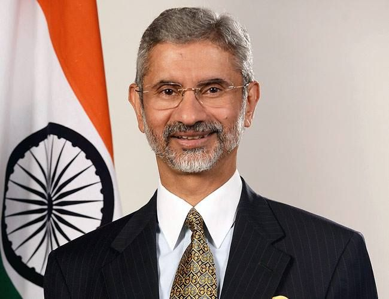
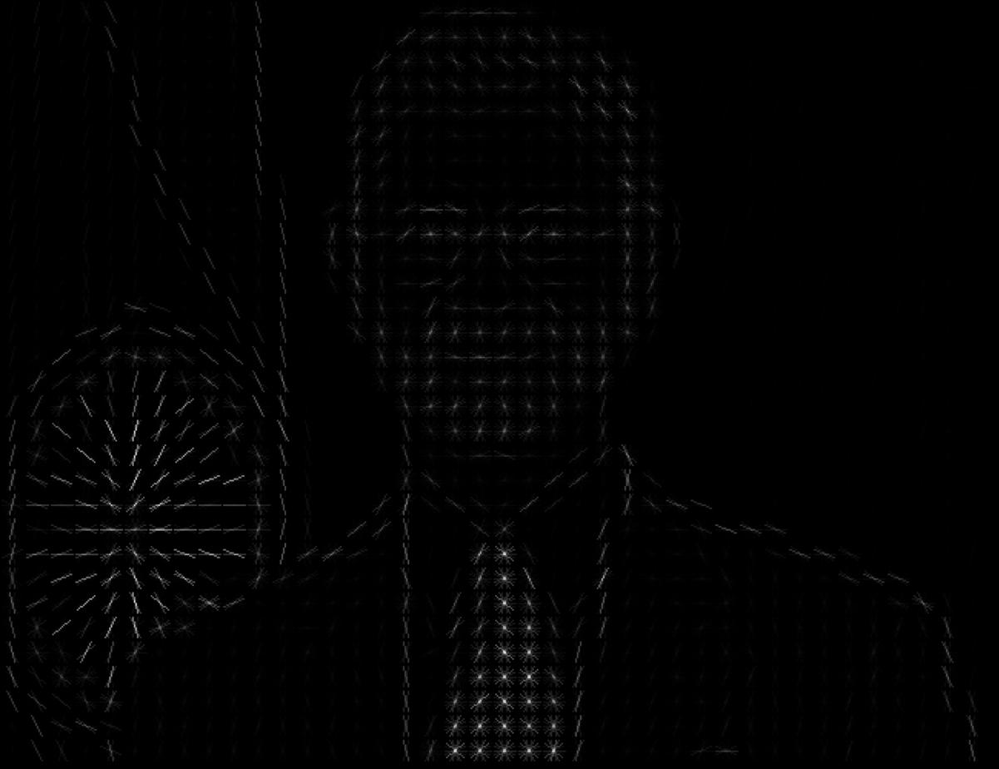
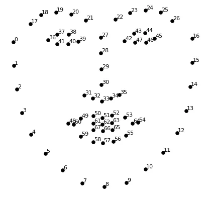
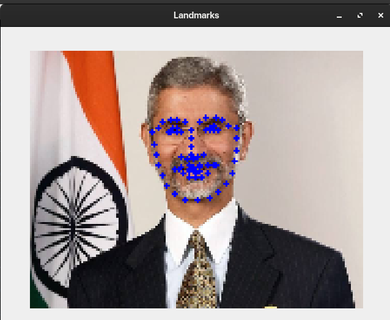
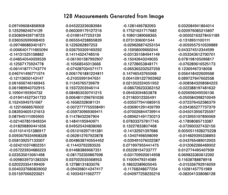

# Algorithms and Techniques

Several Algorithms Processing Techniques are do the whole face recognition

- Detecting Faces
    - HOG model
        - Face detection went mainstream in the early 2000's when Paul Viola and Michael Jones invented a way to detect faces that was fast enough to run on cheap cameras. However, much more reliable solutions exist now. We’re using a method invented in 2005 called Histogram of Oriented Gradients — or just HOG for short.
        - To find faces in an image, we’ll start by making our image black and white because we don’t need color data to find faces: 

            |   |
            |---|
            ||

        - Then we’ll look at every single pixel in our image one at a time. For every single pixel, we want to look at the pixels that directly surrounding it
        - Our goal is to figure out how dark the current pixel is compared to the pixels directly surrounding it. Then we want to draw an arrow showing in which direction the image is getting darker
        - If you repeat that process for every single pixel in the image, you end up with every pixel being replaced by an arrow. These arrows are called gradients and they show the flow from light to dark across the entire image
        - If we analyze pixels directly, really dark images and really light images of the same person will have totally different pixel values. But by only considering the direction that brightness changes, both really dark images and really bright images will end up with the same exact representation. That makes the problem a lot easier to solve
        -But saving the gradient for every single pixel gives us way too much detail. It would be better if we could just see the basic flow of lightness/darkness at a higher level so we could see the basic pattern of the image.
        - To do this, we’ll break up the image into small squares of 16x16 pixels each. In each square, we’ll count up how many gradients point in each major direction (how many point up, point up-right, point right, etc…). Then we’ll replace that square in the image with the arrow directions that were the strongest.
        - The end result is we turn the original image into a very simple representation that captures the basic structure of a face in a simple way:
            |  |  |
            |---|---|
            |||

- Find face Landmarks
    - 68-point face landmark detection
        - The idea of 68-point Landmark detection is we will come up with 68 specific points (called landmarks) that exist on every face — the top of the chin, the outside edge of each eye, the inner edge of each eyebrow, etc. Then we will train a machine learning algorithm to be able to find these 68 specific points on any face:

            |  |
            |---|
            ||

        - Here’s the result of locating the 68 face landmarks on our test image:

            |  |
            |---|
            ||
        
        - Now that we know were the eyes and mouth are, we’ll simply rotate, scale and shear the image so that the eyes and mouth are centered as best as possible. We won’t do any fancy 3d warps because that would introduce distortions into the image. We are only going to use basic image transformations like rotation and scale that preserve parallel lines (called affine transformations)
        - Now no matter how the face is turned, we are able to center the eyes and mouth are in roughly the same position in the image. This will make our next step a lot more accurate.

- Encode Faces
    - 128D(Dimension) face encoding
        - This deep learning algorithm looks at the measurements it is currently generating for each of the images. It then tweaks the neural network slightly so that it makes sure the measurements it generates for #1 and #2 are slightly closer while making sure the measurements for #2 and #3 are slightly further apart
        - This process of training a convolutional neural network to output face embeddings requires a lot of data and computer power. Even with an expensive NVidia Telsa video card, it takes about 24 hours of continuous training to get good accuracy.
        - But once the network has been trained, it can generate measurements for any face, even ones it has never seen before. So this step only needs to be done once. Lucky for us, we got several trained networks which we can directly use.
        - So all we need to do ourselves is run our face images through their pre-trained network to get the 128 measurements for each face. Here’s the measurements for our test image:
            |   |
            |---|
            ||
